# oldge-ui

A Compose Multiplatform implementation of the **oldge-ui** design system: mobile components in the
aesthetic of mid-2000s software — thick glossy frames, dark bodies with a soft glow, chrome orb
buttons, LCD readouts, XP tray balloons — around a toxic lime accent, in three skins.

<table>
  <tr>
    <td align="center">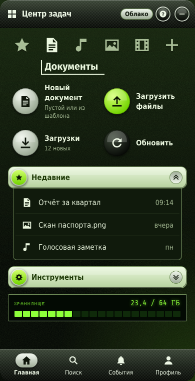</td>
    <td align="center">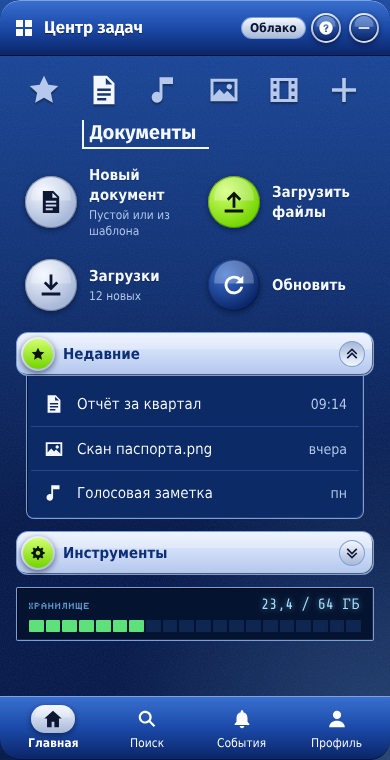</td>
    <td align="center">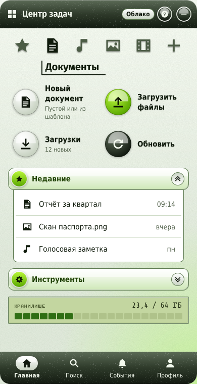</td>
  </tr>
  <tr>
    <td align="center"><b>Toxic</b></td>
    <td align="center"><b>Media</b></td>
    <td align="center"><b>Crystal</b></td>
  </tr>
</table>

All 51 components of the design system are built, with the nine pages of its demo as the sample
app. Each component is held to the design by pixel parity against references rendered from the
design system itself.

Every image here is a screenshot golden: the picture `./gradlew check` compares the code's render
against on every build. So it is what the library draws, not a mock-up.

## Pages

<table>
  <tr>
    <td>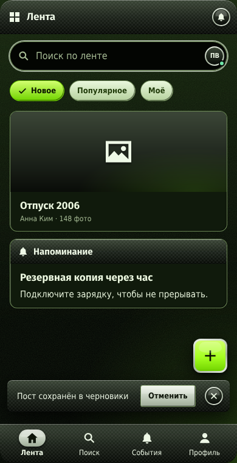</td>
    <td>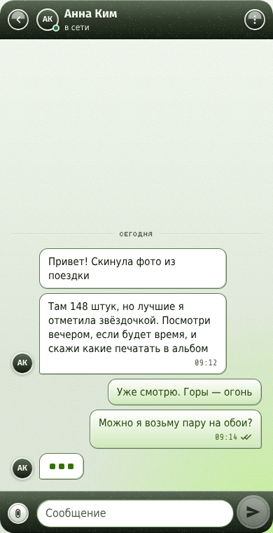</td>
    <td>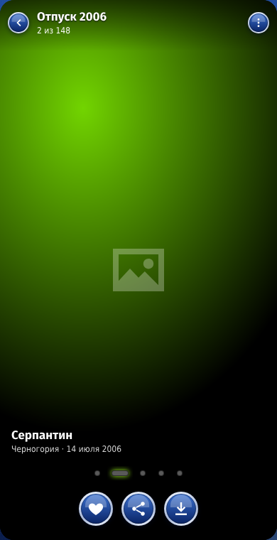</td>
    <td>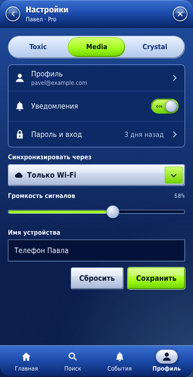</td>
  </tr>
</table>

## Components

<table>
  <tr>
    <td>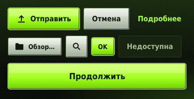</td>
    <td>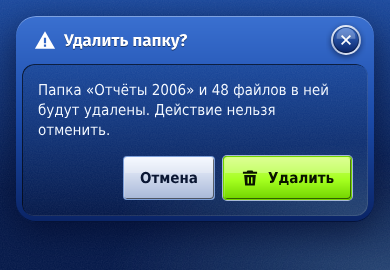</td>
  </tr>
  <tr>
    <td>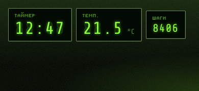</td>
    <td>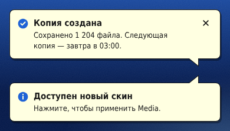</td>
  </tr>
  <tr>
    <td>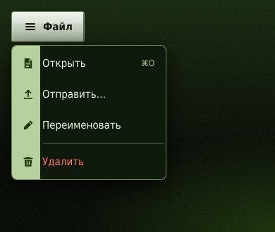</td>
    <td>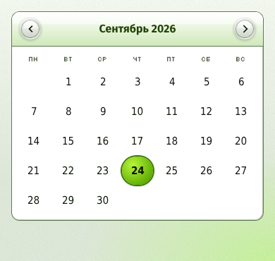</td>
  </tr>
  <tr>
    <td>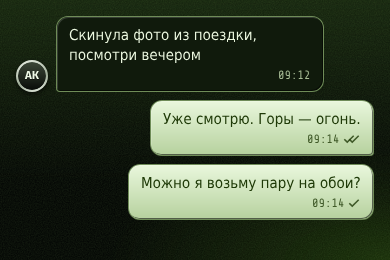</td>
    <td>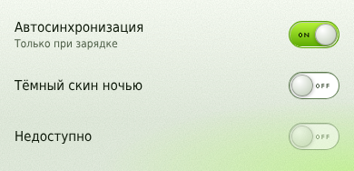</td>
  </tr>
</table>

[docs/components.md](docs/components.md) lists all of them, with the goldens that show each.

## Using it

```kotlin
repositories {
    maven("https://reposilite.kotlin.website/snapshots") {
        mavenContent { includeGroupAndSubgroups("io.github.youndie") }
    }
}

dependencies {
    implementation("io.github.youndie:oldge-core:0.1.0")
}
```

```kotlin
OldgeTheme(OldgeSkin.Toxic) {
    OldgeScreenBody {
        OldgeButton("Войти", onClick = {}, variant = OldgeButtonVariant.Primary)
    }
}
```

Targets: desktop (JVM), Android, iOS (arm64 and the arm64 simulator), and wasm.

The sample app, with a page and skin switcher: `./gradlew :sample:run`.

## Where things are

[docs/](docs/README.md) holds the documentation. Start with the
[architecture research](docs/research/research-architecture.md), then the [backlog](backlog.md).
The design system itself is vendored in [reference/design-system/](reference/design-system/).

## Licence

- **The code** is under the Apache License 2.0 ([LICENSE](LICENSE)).
- **The bundled fonts** are under their own licences: SIL OFL 1.1, and DejaVu's. Their full texts
  are in `oldge-core/src/commonMain/composeResources/files/`, and the POM declares them.
